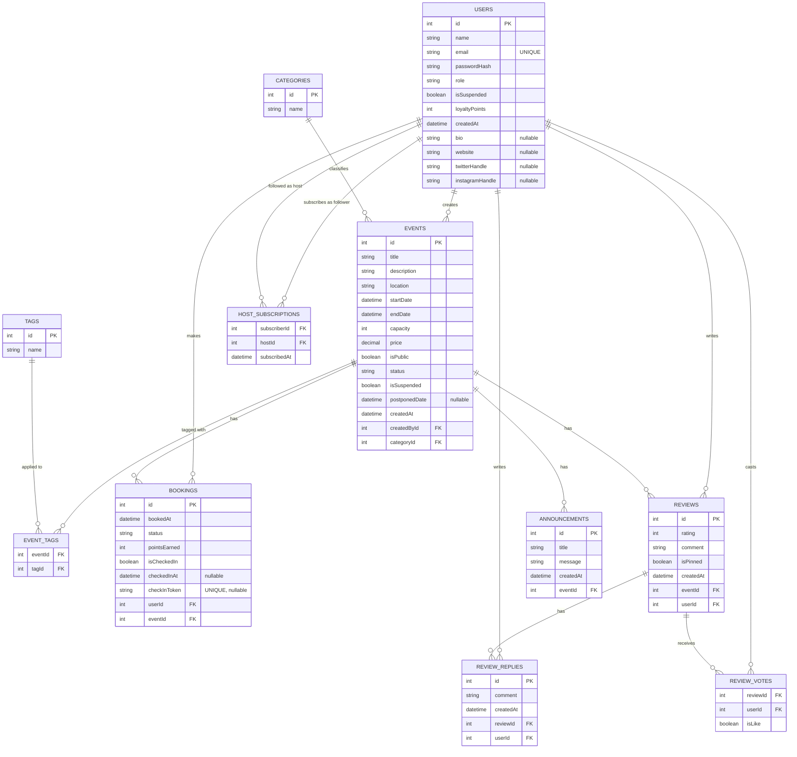

# Database Schema

The system uses **SQLite** in development (swappable to PostgreSQL/MySQL via connection string). The schema is managed by **EF Core 9 code-first migrations**, which are applied automatically on startup.

---

## Table of Contents

1. [Entity-Relationship Diagram](#entity-relationship-diagram)
2. [Table Definitions](#table-definitions)
3. [Constraints & Indexes](#constraints--indexes)
4. [Design Decisions](#design-decisions)
5. [Seeded Data](#seeded-data)
6. [Migrations](#migrations)

---

## Entity-Relationship Diagram



---

## Table Definitions

### `Users`

Stores identity, credentials, role, loyalty state, and public organiser profile fields.

| Column | Type | Constraints | Notes |
|---|---|---|---|
| `id` | INTEGER | PK, auto-increment | |
| `name` | TEXT | NOT NULL | Display name |
| `email` | TEXT | NOT NULL, UNIQUE | Used for login |
| `passwordHash` | TEXT | NOT NULL | BCrypt hash |
| `role` | TEXT | NOT NULL | `"Attendee"` \| `"Admin"` \| `"SuperAdmin"` |
| `isSuspended` | BOOLEAN | NOT NULL, default `false` | Blocks login when `true` |
| `loyaltyPoints` | INTEGER | NOT NULL, default `0` | Cumulative; never goes below 0 |
| `createdAt` | DATETIME | NOT NULL | UTC |
| `bio` | TEXT | nullable | Organiser profile |
| `website` | TEXT | nullable | Organiser profile |
| `twitterHandle` | TEXT | nullable | Organiser profile |
| `instagramHandle` | TEXT | nullable | Organiser profile |

> `LoyaltyTier` and `LoyaltyDiscount` are **not stored** — they are computed properties derived from `loyaltyPoints`.

---

### `Categories`

Coarse event taxonomy. Seeded at startup; managed by Admin via API.

| Column | Type | Constraints |
|---|---|---|
| `id` | INTEGER | PK, auto-increment |
| `name` | TEXT | NOT NULL, UNIQUE |

---

### `Tags`

Fine-grained labels applied to events in a many-to-many relationship. Seeded at startup; managed by Admin via API.

| Column | Type | Constraints |
|---|---|---|
| `id` | INTEGER | PK, auto-increment |
| `name` | TEXT | NOT NULL, UNIQUE |

---

### `Events`

Core entity representing an event through its full lifecycle.

| Column | Type | Constraints | Notes |
|---|---|---|---|
| `id` | INTEGER | PK, auto-increment | |
| `title` | TEXT | NOT NULL | |
| `description` | TEXT | NOT NULL | |
| `location` | TEXT | NOT NULL | |
| `startDate` | DATETIME | NOT NULL | UTC |
| `endDate` | DATETIME | NOT NULL | UTC |
| `capacity` | INTEGER | NOT NULL | Max confirmed bookings |
| `price` | DECIMAL(18,2) | NOT NULL | `0.00` for free events |
| `isPublic` | BOOLEAN | NOT NULL | Private events hidden from non-owners |
| `status` | TEXT | NOT NULL | `"Draft"` \| `"Published"` \| `"Cancelled"` \| `"Postponed"` |
| `isSuspended` | BOOLEAN | NOT NULL, default `false` | Set by Admin; hides event from all listings |
| `postponedDate` | DATETIME | nullable | Original start date, set on postpone |
| `createdAt` | DATETIME | NOT NULL | UTC |
| `createdById` | INTEGER | FK → `Users.id` RESTRICT | Owner; RESTRICT prevents cascade-delete |
| `categoryId` | INTEGER | FK → `Categories.id` | |

> `displayStatus` is **not stored** — it is computed at query time from `status`, `startDate`, `endDate`, `capacity`, and confirmed booking count. Possible values: `Draft`, `Published`, `Live`, `SoldOut`, `Completed`, `Cancelled`, `Postponed`.

---

### `EventTags`

Many-to-many join table between events and tags.

| Column | Type | Constraints |
|---|---|---|
| `eventId` | INTEGER | PK (composite), FK → `Events.id` CASCADE |
| `tagId` | INTEGER | PK (composite), FK → `Tags.id` CASCADE |

---

### `Bookings`

Represents a seat reservation by a user for an event.

| Column | Type | Constraints | Notes |
|---|---|---|---|
| `id` | INTEGER | PK, auto-increment | |
| `bookedAt` | DATETIME | NOT NULL | UTC, set on create/re-activate |
| `status` | TEXT | NOT NULL | `"Confirmed"` \| `"Cancelled"` |
| `pointsEarned` | INTEGER | NOT NULL | Loyalty points awarded; deducted on cancel |
| `isCheckedIn` | BOOLEAN | NOT NULL, default `false` | |
| `checkedInAt` | DATETIME | nullable | Set when checked in |
| `checkInToken` | TEXT | UNIQUE, nullable | UUID; generated on create |
| `userId` | INTEGER | FK → `Users.id` | |
| `eventId` | INTEGER | FK → `Events.id` | |

**Composite unique constraint:** `(userId, eventId)` — one booking row per user per event. Cancelled bookings are re-activated (not duplicated) on re-booking.

---

### `Reviews`

Post-event feedback submitted by attendees with confirmed bookings.

| Column | Type | Constraints | Notes |
|---|---|---|---|
| `id` | INTEGER | PK, auto-increment | |
| `rating` | INTEGER | NOT NULL | 1–5 |
| `comment` | TEXT | NOT NULL | |
| `isPinned` | BOOLEAN | NOT NULL, default `false` | At most one pinned review per event |
| `createdAt` | DATETIME | NOT NULL | UTC |
| `eventId` | INTEGER | FK → `Events.id` | |
| `userId` | INTEGER | FK → `Users.id` | |

**Composite unique constraint:** `(eventId, userId)` — one review per user per event.

---

### `ReviewReplies`

Threaded replies to a review, writable by any authenticated user.

| Column | Type | Constraints |
|---|---|---|
| `id` | INTEGER | PK, auto-increment |
| `comment` | TEXT | NOT NULL |
| `createdAt` | DATETIME | NOT NULL |
| `reviewId` | INTEGER | FK → `Reviews.id` CASCADE |
| `userId` | INTEGER | FK → `Users.id` |

---

### `ReviewVotes`

One like or dislike per user per review. Re-voting updates the existing row.

| Column | Type | Constraints |
|---|---|---|
| `reviewId` | INTEGER | PK (composite), FK → `Reviews.id` CASCADE |
| `userId` | INTEGER | PK (composite), FK → `Users.id` |
| `isLike` | BOOLEAN | NOT NULL |

---

### `HostSubscriptions`

Follow graph between attendees (subscribers) and event organisers (hosts).

| Column | Type | Constraints |
|---|---|---|
| `subscriberId` | INTEGER | PK (composite), FK → `Users.id` RESTRICT |
| `hostId` | INTEGER | PK (composite), FK → `Users.id` RESTRICT |
| `subscribedAt` | DATETIME | NOT NULL |

Self-follows are prevented at the application layer (`400 Bad Request`).

---

### `Announcements`

Broadcast messages attached to an event. Created manually by the host or automatically on cancel/postpone.

| Column | Type | Constraints |
|---|---|---|
| `id` | INTEGER | PK, auto-increment |
| `title` | TEXT | NOT NULL |
| `message` | TEXT | NOT NULL |
| `createdAt` | DATETIME | NOT NULL |
| `eventId` | INTEGER | FK → `Events.id` CASCADE |

---

## Constraints & Indexes

| Table | Index / Constraint | Type | Purpose |
|---|---|---|---|
| `Users` | `email` | UNIQUE | Fast login lookup; prevents duplicate accounts |
| `Events` | `createdById` | FK index | Fast "my events" queries |
| `Events` | `categoryId` | FK index | Fast category filter queries |
| `Bookings` | `(userId, eventId)` | UNIQUE composite | One booking row per user per event |
| `Bookings` | `checkInToken` | UNIQUE | O(1) QR check-in lookup |
| `Bookings` | `eventId` | FK index | Fast "attendees for event" queries |
| `Reviews` | `(eventId, userId)` | UNIQUE composite | One review per user per event |
| `ReviewVotes` | `(reviewId, userId)` | PK (composite) | One vote per user per review |
| `HostSubscriptions` | `(subscriberId, hostId)` | PK (composite) | One follow per (follower, host) pair |

---

## Design Decisions

| Decision | Rationale |
|---|---|
| `LoyaltyTier` / `LoyaltyDiscount` not persisted | Always derivable from `loyaltyPoints`; eliminates sync bugs |
| `displayStatus` not persisted | Derived from stored `status` + current time + booking count; kept in the DTO/query layer |
| `checkInToken` UNIQUE index | Enables O(1) QR lookup without a table scan |
| `Booking(userId, eventId)` unique composite | Enforces one booking per user per event at the DB level; re-booking re-activates the same row |
| `Review(eventId, userId)` unique composite | Enforces one review per user per event at the DB level |
| `ReviewVote` composite PK | One vote record per (review, user) pair; upsert semantics for vote changes |
| `HostSubscription` composite PK | One follow record per (subscriber, host) pair |
| `Event.createdById` → `RESTRICT` on delete | Prevents accidental cascade-delete of all events when a user is removed |
| `HostSubscription.subscriberId/hostId` → `RESTRICT` | Prevents orphaned subscription rows; users must be explicitly deleted separately |
| Categories and tags seeded via EF `HasData` | Consistent reference data across all environments; avoids migration drift |
| Organiser profile fields on `User` model | Avoids a separate `OrganizerProfile` table for a 1:1 relationship; simplifies queries |

---

## Seeded Data

Seed data is applied via EF Core `HasData` in `AppDbContext` and is present in every environment from first startup.

### Categories

| ID | Name |
|----|------|
| 1 | Conference |
| 2 | Workshop |
| 3 | Concert |
| 4 | Sports |
| 5 | Networking |
| 6 | Other |

### Tags

| ID | Name | ID | Name |
|----|------|----|------|
| 1 | Music | 7 | Education |
| 2 | Technology | 8 | Entertainment |
| 3 | Business | 9 | Gaming |
| 4 | Arts | 10 | Outdoor |
| 5 | Food & Drink | 11 | Charity |
| 6 | Health & Wellness | 12 | Family |

---

## Migrations

EF Core migrations are stored in `backend/EventManagement/Migrations/` and applied automatically on startup via `app.MigrateDatabase()` in `Program.cs`. No manual `dotnet ef database update` is required.

To add a migration after a model change:

```bash
cd backend/EventManagement
dotnet ef migrations add <MigrationName>
```

To roll back locally:

```bash
dotnet ef database update <PreviousMigrationName>
```
